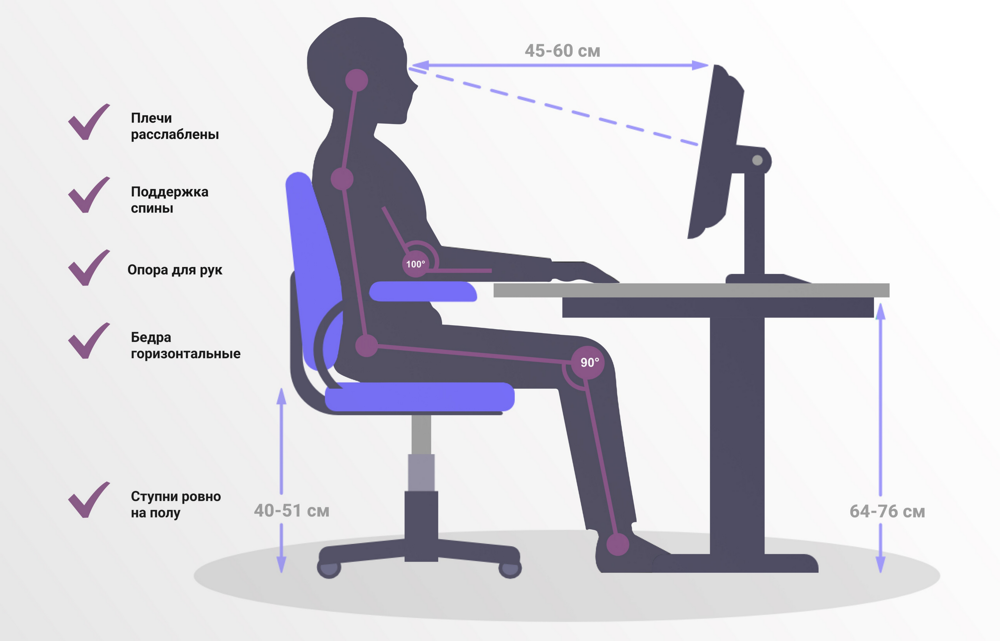

### How Poor Ergonomics Reduces Your Productivity

Poor sitting posture reduces productivity, worsens posture, and causes musculoskeletal symptoms (MSS).

In one study, 67% of students had at least one musculoskeletal symptom. Research also reports a 30% to 66% drop in productivity due to poor ergonomics and incorrect sitting posture. And the best part is: it’s not that hard to fix.

Place your feet flat on the floor, and keep your knees at roughly a 90–110° angle. Your elbows should be around 90°, with your shoulders relaxed. The top edge of your monitor should be roughly at eye level, because your gaze naturally points slightly downward. There are online calculators to fine-tune the ideal desk and chair height.

It also helps to add simple exercises: chin tucks, shoulder blade squeezes, chest stretches, gentle standing back extensions, shoulder circles, and neck rotations. Even better: combine this with stretching, regular exercise, and frequent breaks.

Fixing your ergonomics is an easy way to improve both productivity and health.

https://www.researchgate.net/publication/305853040_Knowledge_and_Practice_of_Laptop_Ergonomics_and_Prevalence_of_Musculoskeletal_Symptoms_among_University_Students
https://elitespinecentres.com/blog/how-posture-affects-productivity-the-hidden-link-to-workplace-success/
https://purecalculators.com/ru/desk-height-calculator

