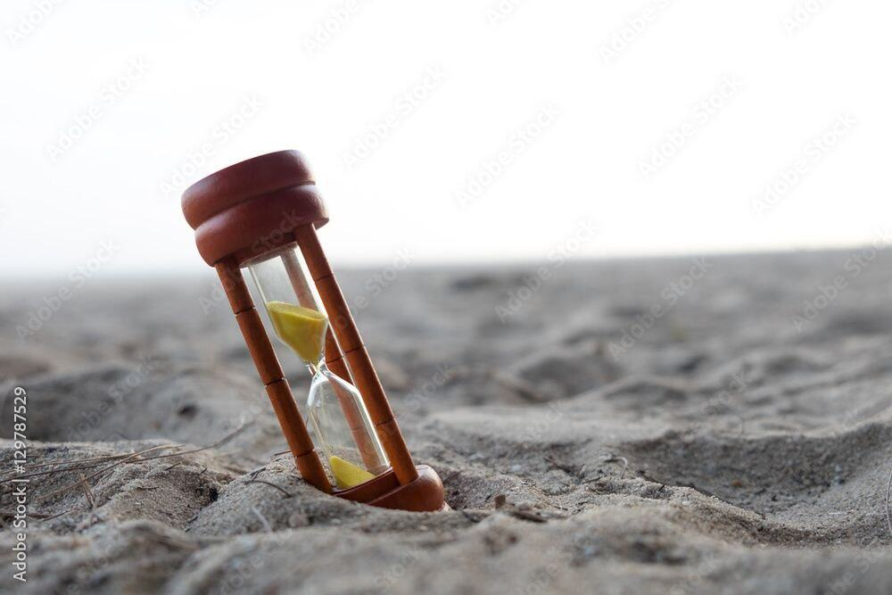
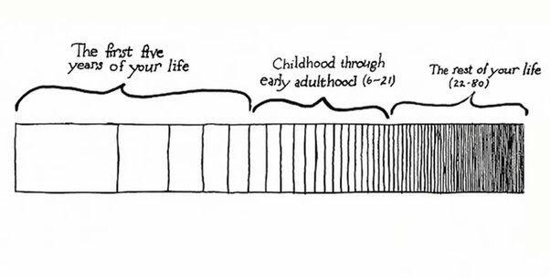

Средняя продолжительность жизни в России — 70 лет. В зависимости от вашего текущего возраста, оставшееся время можно представить так:

| Возраст | Лет осталось | Месяцов | Недель | Дней |
|---------|--------------|---------|--------|------|
| 15      | 55           | 660     | 2870   | 20000 |
| 25      | 45           | 540     | 2340   | 16425 |
| 35      | 35           | 420     | 1820   | 12775 |
| 45      | 25           | 300     | 1300   | 9125  |
| 55      | 15           | 180     | 780    | 5475  |
| 65      | 5            | 60      | 260    | 1825  |

Это меньше 70 весен, лет, осеней и зим. Это меньше 70 дней рождений, новых годов и тд.

### Почему с возрастом время начинает идти быстрее

Чем дольше мы живем, тем больший опыт приобретаем, и с опытом уменьшается острота и яркость внешних впечатлений, из которых как раз и складывается ощущение текущего времени.

Источник: https://moika78.ru/news/2022-11-22/829859-pochemu-s-vozrastom-cheloveku-kazhetsya-chto-vremya-nachinaet-idti-bystree/

### По дням

Если рассматривать один день, то 1/3 дня (8ч) уходит на сон.

Вы все еще хотите использовать 3-6 часов на телефоне из 18 оставшихся? Вы уверены, что именно так вы хотите провести немалую часть вашей жизни?

Средняя ЗП за год в мире ~10000$. Среднее рабочее время в год — 2000-2500 часов. То есть, каждый час стоит 4-5$ Получается за те же 21 час соцсетях за неделю (или 3 за день) вы отдаёте 84–105$ своего времени компаниям вроде Instagram и т.д. Но на самом деле время стоит намного дороже.

Если вы хотите вернуть контроль над своим временем, надо начать сейчас. Запишите куда вы тратите своё время и задумайтесь, куда бы вы на самом деле хотели потратить это время. Какие у вас цели есть в жизни?

Запишите, куда уходит ваше время — и решите, куда вы хотите его тратить на самом деле.
