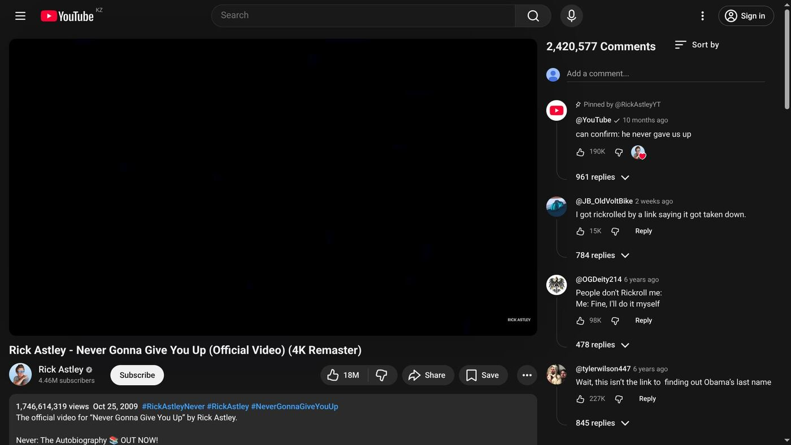

_Auto-translated from the original Russian post._

Have you ever gotten stuck on YouTube longer than you intended? If you want to use the platform more productively, a few extensions can help a lot.

[Right Side Comments](https://la5u.github.io/Right-Side-Comments/) is an extension I have personally been building for more than 3 months. It moves YouTube comments to the right side and places them where recommendations normally appear. That makes it easier to stay focused on the video without the usual distractions.

[DeArrow](https://dearrow.ajay.app/) replaces clickbait thumbnails and titles with more neutral ones.

[Control Panel for YouTube](https://addons.mozilla.org/en-US/firefox/addon/control-panel-for-youtube/) gives you a long list of options: you can disable YouTube Shorts, remove buttons inside videos, hide recommendations in search, and more.

[SponsorBlock](https://sponsor.ajay.app/) automatically skips sponsored segments in videos.

[uBlock Origin](https://ublockorigin.com/) blocks ads and lets you hide almost any element on almost any website. This is the extension I would recommend to nearly everyone.

These tools save time, attention, and patience.

### Links

- Right Side Comments: [Chromium](https://chromewebstore.google.com/detail/right-side-commments/dbbdaiekbopmfbjdchgggfeabapnacnh) / [Firefox](https://addons.mozilla.org/en-US/firefox/addon/right-side-comments/)
- DeArrow: [Chromium](https://chromewebstore.google.com/detail/dearrow-better-titles-and/enamippconapkdmgfgjchkhakpfinmaj) / [Firefox](https://addons.mozilla.org/en-US/firefox/addon/dearrow/)
- Control Panel for YouTube: [Chromium](https://chromewebstore.google.com/detail/control-panel-for-youtube/lodcanccmfbpjjpnngindkkmiehimile) / [Firefox](https://addons.mozilla.org/en-US/firefox/addon/control-panel-for-youtube/)
- SponsorBlock: [Chromium](https://chromewebstore.google.com/detail/sponsorblock-%D1%81%D0%BF%D0%BE%D0%BD%D1%81%D0%BE%D1%80%D0%B1%D0%BB%D0%BE%D0%BA-%D0%B4%D0%BB%D1%8F-youtu/mnjggcdmjocbbbhaepdhchncahnbgone) / [Firefox](https://addons.mozilla.org/en-US/firefox/addon/sponsorblock/)
- uBlock Origin: [Chromium](https://ublockorigin.com/) / [Firefox](https://addons.mozilla.org/en-US/firefox/addon/ublock-origin/)
