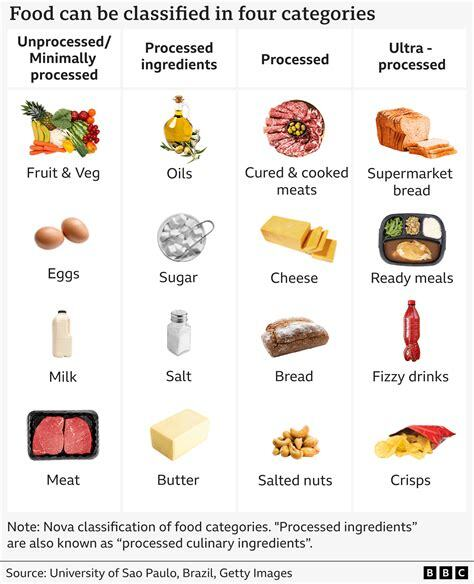
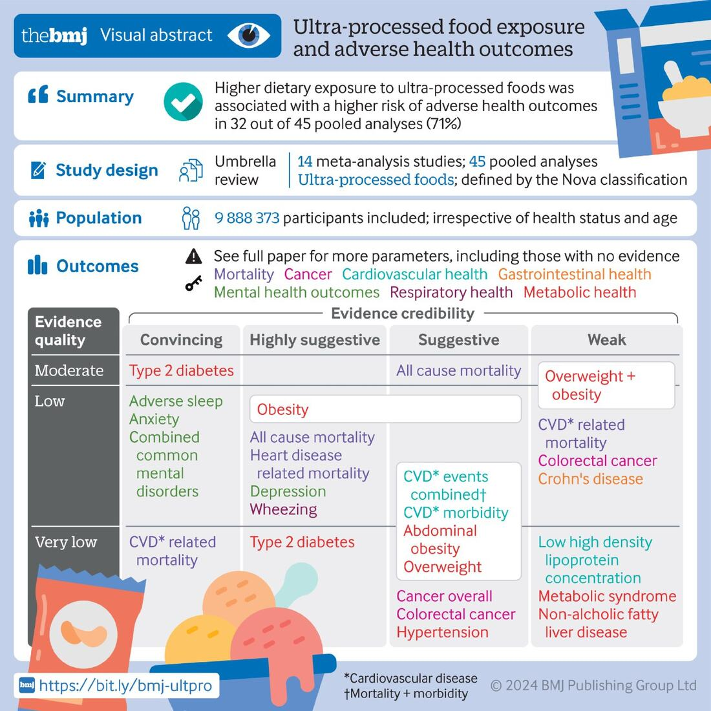

_Auto-translated from the original Russian post._

Why do some food products in stores contain 50 ingredients? A big reason is the long list of additives: preservatives, emulsifiers, colorings, flavorings, sweeteners, and more.

Ultra-processed foods are designed to be as tasty and rewarding as possible, which can encourage overconsumption and habit-forming eating. They often go through industrial processes such as molding, extrusion, hydrogenation, or frying.

Research published in the [British Medical Journal](https://www.bmj.com/content/384/bmj-2023-077310) links high consumption of ultra-processed foods with:

- higher risk of death from cardiovascular disease
- higher risk of all-cause mortality
- obesity
- type 2 diabetes
- anxiety and depression
- sleep problems
- metabolic disorders

This kind of food can also contribute to deficiencies in micronutrients such as iron, minerals, and vitamins.

### What can you do?

Before buying, check the ingredient list and the total number of ingredients. Try to choose whole foods and minimally processed foods more often.
