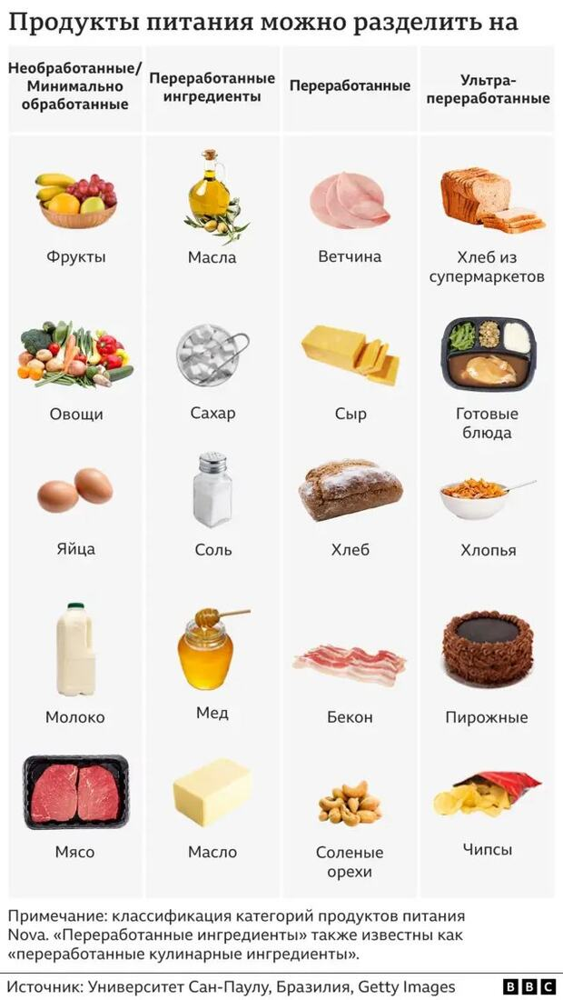

Почему некоторые пищевые товары в магазинах содержат по 50 ингредиентов? Это связано с большим количеством пищевых добавок: консервантов, эмульгаторов, красителей, ароматизаторов, подсластителей и так далее.

Ультрапереработанные продукты разрабатываются так, чтобы быть максимально приятными на вкус, вызывать привыкание и желание есть их снова. Они часто проходят промышленные процессы, такие как формование, экструзия, гидрогенизация или жарка.

Исследования, опубликованные в [British Medical Journal](https://www.bmj.com/content/384/bmj-2023-077310), связывают высокое потребление ультрапереработанных продуктов с:

- повышенным риском смерти от сердечно-сосудистых заболеваний
- повышенным риском общей смертности
- ожирением
- сахарным диабетом 2 типа
- тревожными расстройствами и депрессией
- проблемами со сном
- метаболическими нарушениями

Такая пища также может приводить к дефициту микроэлементов, включая железо, минералы и витамины.

### Что можно сделать?

Перед покупкой смотрите на состав и количество ингредиентов. Старайтесь чаще выбирать цельные и минимально обработанные продукты.
